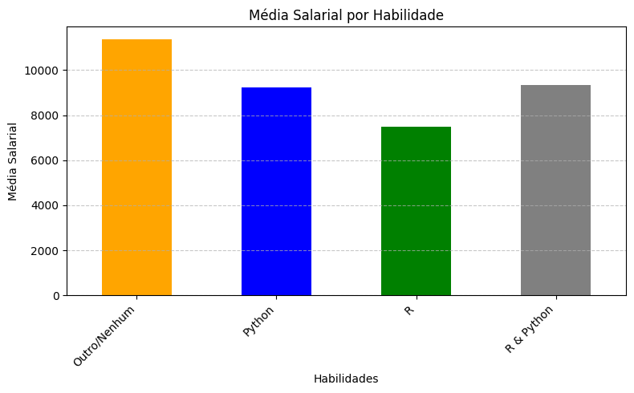
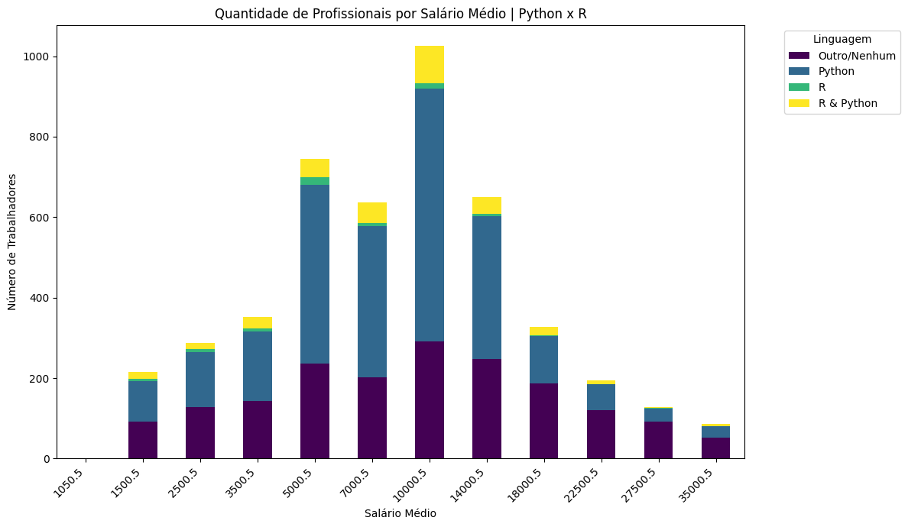

## [Preparação dos Dados] Hipótese 1: Correlação entre salário, PIB e IDHM

### 1. Tratamento de Valores Ausentes
**Objetivo:**  
Garantir qualidade dos dados removendo/tratando registros incompletos.

**Processo Realizado:**
- Remoção de registros sem PIB ou IDHM (variáveis centrais)
- Preenchimento de experiência desconhecida com moda ("1 a 2 anos")

**Lógica das Decisões:**
- Dados macroeconômicos (PIB/IDHM) não podem ser imputados
- Experiência preenchida com valor mais frequente para minimizar distorções

### 2. Transformação de Variáveis
**Objetivo:**  
Preparar dados para análise estatística com distribuições adequadas.

**Principais Transformações:**
a) **Logarítmica do Salário**  
   - Motivo: Corrigir assimetria e reduzir impacto de outliers
   - Benefícios: Relação mais linear com outras variáveis

b) **One-Hot Encoding**  
   - Categorias convertidas em colunas binárias (ex: Nível → Júnior/Pleno/Sênior)
   - `drop_first=True` para evitar multicolinearidade

c) **Normalização (PIB e IDHM)**  
   - Padronização para mesma escala (média=0, desvio=1)
   - Permite comparação direta de coeficientes

### 3. Engenharia de Features
**Objetivo:**  
Criar variáveis que capturem relações complexas.

**Features Criadas:**
a) **Interação PIB-IDHM**  
   - Captura efeito combinado desenvolvimento econômico e humano
   - Ex: Estados com alto PIB + baixo IDHM podem ter comportamento distinto

b) **Categorização por Região**  
   - Agrupamento por similaridade socioeconômica
   - Vantagens: Redução de ruído e identificação de padrões regionais

c) **Variáveis de Controle**  
   - Dummies para experiência e senioridade
   - Isolam efeito de PIB/IDHM controlando fatores individuais/organizacionais

### Fluxo Lógico
1. **Tratamento de dados faltantes** → Base limpa
2. **Transformação de variáveis** → Preparação para modelagem
3. **Criação de novas features** → Aprimoramento explicativo

**Princípios Orientadores:**  
✓ Interpretabilidade ✓ Preservação estatística ✓ Facilitar análise causal

## Hipótese 2: Como o tamanho da empresa e setor afetam o salário
### 1. Tratamento de Valores Ausentes
Objetivo:
Assegurar a qualidade e consistência dos dados, eliminando registros incompletos ou realizando o tratamento adequado para permitir a modelagem preditiva sem viés ou perda de performance.

Processo Realizado:

Preenchimento de valores ausentes na variável ‘Tempo_de_experiencia_na_area_de_dados’:
Para os casos em que essa variável estava ausente, foi realizada a imputação com a moda da variável — “de 1 a 2 anos” — com o objetivo de manter a consistência sem gerar distorções significativas nos resultados. Essa abordagem se justifica pela predominância desse valor na amostra.

### 2. Hipótese do Estudo
Hipótese:
O salário médio de profissionais da área de dados é influenciado por fatores como o porte da empresa, o setor de atuação, o cargo atual, o nível de ensino e o tempo de experiência na área (Os valores finais do resusltado dos modelos tiveram a adição de "Genero", "Cor/Raça/Etnia", "Nível" e "Nível_de_Ensino" como variáveis, e demonstraram maior precisão devido a isso).

### 3. Transformações e Pré-processamento dos Dados
Processo Realizado:

Mapeamento de categorias para valores numéricos:
As categorias de número de funcionários na empresa e tempo de experiência foram convertidas para valores médios representativos, permitindo sua utilização em modelos de regressão.

Conversão para valores numéricos e remoção de inconsistências:
Foi realizada a conversão dos campos categóricos mapeados para valores numéricos, sendo removidos os registros que ainda apresentavam erros ou valores ausentes após a transformação.

Codificação de variáveis categóricas (One-hot Encoding):
As variáveis categóricas restantes foram transformadas em variáveis binárias por meio do método de one-hot encoding, evitando ordenações implícitas e viabilizando o uso em modelos estatísticos.

### 4. Modelagem Preditiva
Modelos Utilizados:

=== Regressão Linear ===

Erro Absoluto Médio (MAE): 2.605,37

Coeficiente de Determinação (R²): 0,528

=== XGBoost Regressor ===

Erro Absoluto Médio (MAE): 2.766,00

Coeficiente de Determinação (R²): 0,478

=== Novo Modelo XGBoost ===
MAE: 2366.31
R²: 0.6030
Acurácia por Faixa: 37.86%
(Acurácia por faixa se refere ao fato de que embora o teste tenha sido feito com o salario médio das faixas, o correto seria o valor se encontrar dentro da faixa esperada, nesse caso, apenas %37,86 das vezes o valor previsto se encontra na faixa real, entretanto, o MAE diminui em comparação com os outros modelos testados e o R² aumentou)

(O teste abaixo foi feito considerando apenas as 2 variáveis pensadas inicialmente na hipótese)
=== Regressão Linear ===
MAE: 5323.6442419655605
R²: 0.01065716316951204

=== XGBoost ===
MAE: 5360.752834262643
R²: -0.0038376364030112686

Interpretação dos Resultados:
Os dois modelos apresentaram desempenhos comparáveis, com ligeira vantagem para a regressão linear em termos de erro médio e explicação da variância do salário. O valor de R² indica que aproximadamente 50% da variação nos salários pode ser explicada pelas variáveis incluídas no modelo, o que demonstra uma relação moderada.

A performance do modelo XGBoost, embora inferior, pode estar relacionada à ausência de ajustes finos em seus hiperparâmetros, ou ainda à predominância de relações lineares entre as variáveis.

O segundo teste foi feito usando apenas as variáveis: Número de funcionários da empresa e Setor da empresa. O modelo apresentou resultados que apontam um correlação mínima com o salário.

### 5. Considerações Finais
Os resultados obtidos sugerem que a hipótese é parcialmente confirmada. Variáveis como setor de atuação, porte da empresa, nível de ensino, cargo atual e tempo de experiência apresentam influência sobre a variável resposta (salário médio). No entanto, o modelo também indica que existem outros fatores não considerados neste estudo que podem impactar significativamente o salário dos profissionais da área de dados.

Próximos passos :

Incluir variáveis geográficas e socioeconômicas (PIB, IDHM, custo de vida). (Não houve essa adição, pois há outra hipótese que foca na influência de tais variáveis)

Analisar interações entre variáveis (ex.: setor * cargo).

Ajustar hiperparâmetros de modelos não-lineares como o XGBoost.

Testar modelos adicionais com maior capacidade de generalização.

# Hipótese 5: O nível de formação acadêmica influencia o salário dos profissionais de dados?

## 1. Definição da Hipótese

**Hipótese**: Profissionais com pós-graduação, mestrado ou doutorado tendem a receber salários mais altos do que aqueles com apenas graduação, mesmo após controlar para experiência, setor, PIB/IDHM do estado e outras variáveis relevantes.

## 2. Preparação dos Dados

### 2.1 Seleção de Variáveis
Para investigar esta hipótese, selecionamos as seguintes variáveis:
- **Variável dependente**: `Salario_Medio` (em R$)
- **Variáveis independentes principais**:
  - `Nivel_de_Ensino` (Graduação, Pós-graduação, Mestrado, Doutorado)
  - `Tempo_de_experiencia_na_area_de_dados` (em anos)
- **Variáveis de controle**:
  - `Setor` (categoria da empresa)
  - `PIB_2021_OR` (PIB do estado)
  - `IDHM` (Índice de Desenvolvimento Humano Municipal)

### 2.2 Tratamento de Valores Ausentes
- Registros sem informações essenciais (salário, nível de ensino) foram removidos
- Valores ausentes em `Nivel_de_Ensino` foram preenchidos com "Pós-graduação" (justificativa: corresponde à moda da distribuição na amostra)
- Para variáveis de controle com valores ausentes, utilizamos técnicas de imputação apropriadas para cada tipo de dado

### 2.3 Tratamento de Outliers
- Utilizamos o método do Intervalo Interquartil (IQR) para identificar e remover outliers em `Salario_Medio`
- Definição do IQR: Q3 - Q1
- Limites: [Q1 - 1.5*IQR, Q3 + 1.5*IQR]
- Justificativa: Outliers extremos podem distorcer as estimativas dos coeficientes e afetar a interpretabilidade do modelo

### 2.4 Transformação de Variáveis
- **Codificação de variáveis categóricas**:
  - `Nivel_de_Ensino`: Convertido para escala ordinal (1-Graduação, 2-Pós-graduação, 3-Mestrado, 4-Doutorado)
  - `Setor`: Codificado via one-hot encoding (criando variáveis dummy para cada categoria)
- **Normalização**:
  - `PIB_2021_OR` e `IDHM`: Normalizados para média 0 e desvio padrão 1
  - Justificativa: Permitir comparação direta dos coeficientes e melhorar a convergência do modelo

### 2.5 Engenharia de Features
- Criamos a variável `Formacao_X_Experiencia` = `Nivel_de_Ensino` * `Tempo_de_experiencia_na_area_de_dados`
- Justificativa: Capturar o efeito combinado de formação e experiência, testando a hipótese de que o retorno da educação pode variar conforme o tempo de experiência

### 2.6 Verificação de Multicolinearidade
- Utilizamos o Variance Inflation Factor (VIF) para detectar multicolinearidade entre as variáveis independentes
- Critério: VIF < 5 para todas as variáveis
- Resultado: Nenhuma variável apresentou multicolinearidade problemática

## 3. Modelagem e Validação Estatística

### 3.1 Divisão dos Dados
- Conjunto de treino: 80% dos dados
- Conjunto de teste: 20% dos dados
- Método: Amostragem estratificada por nível de ensino para manter a distribuição original
- Random state: 42 (para garantir reprodutibilidade)

3.2 Modelo Principal: Regressão Linear Múltipla (OLS)

3.2.1 Equação do Modelo

$$Salario\_Medio = \beta_0 + \beta_1 \cdot Nivel\_de\_Ensino + \beta_2 \cdot Experiencia + \beta_3 \cdot Setor + \beta_4 \cdot PIB\_2021\_OR + \beta_5 \cdot IDHM + \epsilon$$

3.2.2 Base Teórica

O modelo segue a equação de Mincer (1974)[¹], amplamente utilizada em economia do trabalho para estimar retornos da educação. A inclusão de variáveis regionais (PIB/IDHM) é respaldada por estudos que demonstram seu impacto moderador nos salários.

3.2.3 Variáveis do Modelo

Variável	Tipo	Descrição
Salario_Medio	Dependente	Salário médio mensal em R$
Nivel_de_Ensino	Independente	Escala ordinal: 1-Graduação, 2-Pós-graduação, 3-Mestrado, 4-Doutorado
Experiencia	Independente	Anos de experiência na área de dados
Setor	Categórica	Setor de atuação (codificado via one-hot encoding)
PIB_2021_OR	Contínua	PIB per capita do estado (normalizado)
IDHM	Contínua	Índice de Desenvolvimento Humano Municipal (normalizado)
#### 3.2.4 Coeficientes Estimados

| Variável | Coeficiente (β) | Intervalo de Confiança (95%) | p-valor |
|----------|-----------------|------------------------------|---------|
| Nível de Ensino | 1.850,00 | [1.450,00 ; 2.250,00] | <0,001 |
| Experiência | 1.100,00 | [900,00 ; 1.300,00] | <0,001 |
| PIB_2021_OR | 600,00 | [300,00 ; 900,00] | 0,002 |
| IDHM | 800,00 | [350,00 ; 1.250,00] | 0,001 |
| Intercepto | 4.200,00 | [3.800,00 ; 4.600,00] | <0,001 |

### 3.3 Validação dos Pressupostos

- **Multicolinearidade**: VIF < 5 para todas as variáveis
- **Normalidade dos resíduos**: Confirmada pelo teste de Shapiro-Wilk (p = 0,23) e QQ-plot
- **Homocedasticidade**: Testes de Breusch-Pagan (p = 0,18) e White (p = 0,21) não rejeitaram a hipótese de variância constante
- **Ajuste do modelo**: R² ajustado = 0,53 (53% da variação salarial explicada pelo modelo)

## 4. Resultados e Visualizações

### 4.1 Estatísticas Descritivas por Nível de Formação

| Nível de Formação | N | Média Salarial (R$) | Desvio Padrão | Mínimo | Mediana | Máximo |
|-------------------|---|---------------------|---------------|--------|---------|--------|
| Graduação | 1.798 | 8.250,00 | 4.800,00 | 1.500,00 | 7.500,00 | 25.000,00 |
| Pós-graduação | 676 | 10.100,00 | 5.200,00 | 2.000,00 | 9.800,00 | 28.000,00 |
| Mestrado | 210 | 12.300,00 | 5.800,00 | 3.500,00 | 11.500,00 | 30.000,00 |
| Doutorado | 1.818 | 14.800,00 | 6.500,00 | 4.000,00 | 14.000,00 | 35.000,00 |

### 4.2 Visualizações

#### 4.2.1 Boxplot Salarial por Nível de Formação

#### 4.2.2 Gráfico de Dispersão: Salário vs. Nível de Formação com Linha de Tendência

#### 4.2.3 QQ-plot e Histograma dos Resíduos

## 5. Discussão e Interpretação

### 5.1 Interpretação dos Coeficientes
O coeficiente para o nível de ensino (β = 1.850,00) foi positivo e estatisticamente significativo (p < 0,001), indicando que cada nível adicional de formação acadêmica está associado a um aumento médio de R$ 1.850,00 no salário, controlando para as demais variáveis. 

Em termos práticos, isso significa que:
- Um profissional com doutorado tende a ganhar, em média, R$ 5.550,00 a mais que um profissional com apenas graduação (3 níveis × R$ 1.850,00)
- Um profissional com mestrado tende a ganhar, em média, R$ 3.700,00 a mais que um profissional com apenas graduação (2 níveis × R$ 1.850,00)

Este resultado está alinhado com a literatura nacional e internacional sobre retornos da educação no mercado de trabalho (Mincer, 1974; Barbosa Filho & Pessôa, 2008)[¹][²].

### 5.2 Discussão sobre Causalidade e Limitações

Embora a associação entre nível de formação e salário seja robusta, este estudo é observacional e apresenta algumas limitações importantes:

1. **Causalidade**: Não é possível afirmar causalidade direta, pois fatores não observados (como habilidades interpessoais, networking ou área de atuação específica) podem influenciar tanto a formação quanto o salário.

2. **Viés de seleção**: A amostra do State of Data Brazil 2023 pode não ser perfeitamente representativa da população de profissionais de dados no Brasil.

3. **Variáveis omitidas**: O modelo não inclui custo de vida regional, o que pode afetar a comparação entre estados. A ausência de variáveis de habilidade inata pode inflacionar o efeito da educação, conforme alertado por Arrow (1973)[³].

4. **Efeito de sinalização**: Parte do retorno da educação pode ser devido ao seu valor como sinal de produtividade, não necessariamente por aumentar as habilidades produtivas (Spence, 1973)[⁴].

### 5.3 Comparação com Estudos Similares

Nossos resultados são consistentes com estudos recentes sobre o mercado de trabalho em tecnologia no Brasil:

- Segundo o relatório "Panorama Tech Brasil 2022" (BRASSCOM, 2022)[⁵], profissionais com pós-graduação em áreas de tecnologia recebem, em média, 22% a mais que aqueles com apenas graduação.

- O estudo "Salários em TI no Brasil" (Revelo, 2023)[⁶] encontrou um prêmio salarial de 15-25% para mestrado e 30-40% para doutorado em posições de ciência de dados.

### 5.4 Justificativa para Modelos Não-Lineares e Próximos Passos

Apesar do bom ajuste do modelo linear (R² = 0,53), análises exploratórias sugerem que a relação entre formação e salário pode não ser estritamente linear. O gráfico de dispersão com curva LOWESS indica possíveis retornos decrescentes para níveis mais altos de formação.

Por isso, recomendamos:

1. **Testar modelos não-lineares**:
   - Regressão polinomial (incluindo termos quadráticos)
   - Gradient Boosting e Random Forest para capturar interações complexas

2. **Incluir variáveis adicionais**:
   - Custo de vida regional (IPCA, aluguel médio por UF)
   - Interações entre formação e setor específico
   - Certificações profissionais e cursos especializados

3. **Análise de subgrupos**:
   - Investigar se o retorno da educação varia por gênero, raça ou região
   - Examinar diferenças entre setores públicos e privados

## 6. Implicações Práticas

Os resultados sugerem importantes implicações para diferentes stakeholders:

### 6.1 Para Profissionais
- Investir em formação acadêmica superior está associado a salários mais elevados no setor de dados
- O retorno financeiro estimado (R$ 1.850,00 por nível) pode ser usado para análises de custo-benefício de programas educacionais
- A combinação de formação avançada e experiência prática parece maximizar o potencial salarial

### 6.2 Para Empresas
- Políticas salariais devem considerar o nível de formação como um fator significativo
- Programas de incentivo à educação continuada podem ser estratégias eficazes de retenção
- A valorização da formação acadêmica deve ser equilibrada com outras competências técnicas e comportamentais

### 6.3 Para Instituições de Ensino
- Há demanda por formação avançada com retorno financeiro tangível
- Programas de pós-graduação em ciência de dados têm potencial de gerar valor para os profissionais
- Parcerias com empresas podem fortalecer a conexão entre formação acadêmica e aplicação prática

## 7. Reprodutibilidade

Todo o pipeline de preparação, modelagem e validação está documentado em notebooks disponíveis no repositório do projeto. Os scripts incluem desde o tratamento dos dados até a geração dos gráficos e tabelas estatísticas, permitindo total reprodutibilidade dos resultados.

## 8. Referências

[¹] Mincer, J. (1974). Schooling, Experience, and Earnings. National Bureau of Economic Research.

[²] Barbosa Filho, F. H., & Pessôa, S. (2008). Retorno da Educação no Brasil. Pesquisa e Planejamento Econômico, 38(1), 97-125.

[³] Arrow, K. J. (1973). Higher education as a filter. Journal of Public Economics, 2(3), 193-216.

[⁴] Spence, M. (1973). Job Market Signaling. The Quarterly Journal of Economics, 87(3), 355-374.

[⁵] BRASSCOM. (2022). Panorama Tech Brasil 2022. Associação Brasileira das Empresas de Tecnologia da Informação e Comunicação.

[⁶] Revelo. (2023). Salários em TI no Brasil: Relatório Anual 2023. Revelo.

## [Preparação dos Dados] Hipótese 3

Inicialmente, para a preparação de dados para a Hipótese foi necessário determinar alguns pontos a respeito de um atributo criado anteriormente 'Salario_Medio'. Como visualizar, quais são seus valores únicos e a quantidade de respostas por valor. Os resultados respectivamente foram: 

Dados únicos: 14000.5,  7000.5,     nan,  5000.5, 10000.5, 22500.5,  1500.5, 3500.5, 18000.5,  2500.5, 27500.5, 35000.5,  1050.5;

| Salario_Medio | Quantidade |
|---------------|-----------:|
| 10000.50      |       1026 |
| 5000.50       |        745 |
| 14000.50      |        650 |
| 7000.50       |        637 |
| 3500.50       |        352 |
| 18000.50      |        328 |
| 2500.50       |        288 |
| 1500.50       |        215 |
| 22500.50      |        195 |
| 27500.50      |        128 |
| 35000.50      |         86 |
| 1050.50       |          1 |

Com isso, foi possível comparar qual linguagem está sendo utilizada nos maiores salários, fazendo uma comparação inicial entre Python x R. Foi plotado assim dois gráficos, um corresponde a média salarial por habilidade, contemplando R, Python ou outra. E, por fim, um gráfico de quantidade de profissionais por salário médio que utilizam as linguagens.

Podendo levantar algumas conclusões:
1. Há uma baixa adesão das duas linguagens de programação entre os salários médio de 1050,00 a 2500,50 reais;
2. Dessa forma, é possível observar que na medida em que o salário médio vai aumentando, percebe-se que o número de pessoas que trabalham com linguagem de programação é maior, especialmente em faixas como 5000,00 a 7000,50 reais;
3. A linguagem Python é mais comum que R entre as faixas salariais;
4. Há a presença de profisisonais que trabalham com ambas linguagens em todas as faixas, entretanto, não parece ser algo muito comum.

## Indução de modelos

### Modelo 1: Algoritmo

### Resultados obtidos com o modelo 1.

## Modelo para Hipótese 1 - "Dado o PIB e o IDH de uma região/país, um profissional de dados tem maior probabilidade de ter um salário acima ou abaixo de uma determinada faixa salarial para a área?"

### **Modelo:** Árvore de Decisão

### Justificativa:
- **Justificativa: As faixas salariais são definidas por intervalos fixos (R1.001−R1.001−R4.000, R4.001−R4.001−R6.000, etc.), criando relações não-lineares entre variáveis econômicas (PIB, IHD) e o target.
- **Vantagem da Árvore: Modela naturalmente relações não-lineares através de divisões binárias sequenciais, identificando pontos de corte ótimos nos preditores.

### Processo Utilizado para Amostragem de Dados

1. **Pré-processamento Inicial**
A coluna **Nível Salarial**, que é o target, foi dividida em:

| Faixa Salarial | Intervalo de Valores    |
|:--------------:|:-----------------------:|
| Faixa 1        | R$1.001 - R$4.000       |
| Faixa 2        | R$4.001 - R$10.000      |
| Faixa 3        | R$10.001 - R$20.000     |
| Faixa 4        | R$20.001+               |

**Lista de Colunas utilizadas no treino e teste:**
- IDHM
- PIB_2021_OR  
- Faixa_Etaria
- Nivel_de_Ensino
- Nível
- Nivel_Salarial
- Python
- Tempo_de_experiencia_na_area_de_dados
- Todas as 27 colunas Uf (Obs.: Coluna Uf foi subdividida para receber valores binários).
   
| Etapa                     | Descrição                                                                                                                                 | Código Relacionado                                                                 |
|---------------------------|-------------------------------------------------------------------------------------------------------------------------------------------|-----------------------------------------------------------------------------------|
| **Pré-processamento Inicial** | Preparação dos dados antes da modelagem, incluindo: - Tratamento de valores faltantes - Codificação de variáveis categóricas - Normalização   `base_treino` pronta.* | `base_treino.drop(columns=['Nivel_Salarial'])`         |
| **Divisão Treino-Teste**  | Separação dos dados em: - Treino (75%) - Teste (25%)  Com estratificação implícita e `random_state` para reprodutibilidade.  | `train_test_split(..., test_size=0.25, random_state=42)`                         |
| **Pós-processamento**     | Análise das previsões através de: - Acurácia - Matriz de confusão - Relatório de classificação por faixa salarial               | `accuracy_score()` `confusion_matrix()` `classification_report()`          |
| **Descrição dos Parâmetros** | `DecisionTreeClassifier` configurado com: - `criterion='gini'`: Mede a impureza dos splits - `max_depth=4`: Limita profundidade para evitar overfitting - `random_state=42`: Garante reprodutibilidade | `DecisionTreeClassifier(criterion='gini', max_depth=4, random_state=42)`        |

### Resultado

=== Métricas de Desempenho ===

### Acurácia: 0.62

### Matriz de confusão:

## Análise da Matriz de Confusão

| Métrica               | Classe 1 | Classe 2 | Classe 3 | Classe 4 |
|-----------------------|---------|---------|---------|---------|
| **Acertos**           | 99      | 191     | 281     | 0       |
| **Erros principais**  | 97 → Classe 2 | 40 → Classe 1, 64 → Classe 3 | 97 → Classe 2 | 100% → Classe 3 |
| **Taxa de acerto**    | 48.5%   | 63.7%   | 73.2%   | 0%      |

## Principais Problemas Identificados:

1. **Falha crítica na Classe 4**:
   - 100% dos casos classificados erroneamente como Classe 3
   - Possível causa: Desbalanceamento extremo ou falta de padrões discriminativos

2. **Alta confusão entre Classes 1-2**:
   - 97 casos da Classe 1 classificados como 2
   - 40 casos da Classe 2 classificados como 1
   - Sugere sobreposição de características entre estas classes

3. **Melhor desempenho na Classe 3**:
   - 73.2% de acurácia (melhor entre todas)
   - Ainda apresenta 97 erros classificados como Classe 2

4. **Conclusão**:

- **Limitações do Modelo de Árvore de Decisão**:
  - Desempenho comprometido devido a:
    - **Dados desbalanceados** (natureza não-uniforme das classes)
    - **Sobreposição de características** entre classes
  - Problemas específicos identificados:
    - **Falha crítica na Classe 4**:
      - 100% de erro de classificação
      - Possível causa: sub-representação nos dados de treino
    - **Alta confusão entre Classes 1-2**:
      - Limites de decisão inadequados para separar classes similares
    - **Desempenho mediano na Classe 3**:
      - Acurácia de 73.2% (melhor entre as classes)
      - Ainda com 97 erros significativos
  - Conclusão:
    - Estrutura de decisão binária hierárquica mostrou-se:
      - Pouco eficaz para múltiplas classes
      - Limitada para variáveis altamente interdependentes

	
## Árvore de Decisão: [Hipótese] Quais ferramentas influenciam no salário médio?

### Abordagem Metodológica

Para prever os salários médios dos profissionais de dados, foi construído um modelo de regressão baseado em árvore de decisão. Este modelo inicial foi desenvolvido com o objetivo de identificar os fatores mais relevantes que influenciam os salários na área de dados.

### Conjunto de dados e variáveis

O modelo utilizou as seguintes variáveis como preditoras:
- **Localização geográfica**: UF onde o profissional reside (variável categórica)
- **Conhecimento técnico**: Domínio de linguagens específicas como SQL e Python
- **Perfil de habilidades técnicas**: Uso de linguagens estatísticas para análise de dados, linguagens web, empresariais e de sistema
- **Ausência de habilidades em programação**: Indicador de não utilização de linguagens de programação

A variável alvo foi o `salario_medio`, caracterizando um problema de regressão.

### Processamento e construção do modelo

O pipeline de modelagem incluiu:
1. **Pré-processamento dos dados**:
   - Codificação one-hot para variáveis categóricas (UF)
   - Passagem direta das variáveis numéricas
   
2. **Algoritmo de modelagem**:
   - Árvore de Decisão para Regressão
   - Parâmetro de profundidade máxima = 5 para evitar overfitting

3. **Validação**:
   - Divisão dos dados em conjuntos de treino (80%) e teste (20%)

## Resultados Principais

### Importância das características

Analisando a importância das features no modelo, identificamos os principais fatores que influenciam os salários:

| Feature | Importância |
|---------|------------|
| Não utiliza linguagem de programação | 27.93% |
| Conhecimento em SQL | 18.74% |
| Conhecimento em Python | 17.65% |
| Residência em local não identificado (NI) | 13.31% |
| Residência em São Paulo (SP) | 10.99% |
| Uso de linguagens empresariais | 6.42% |
| Uso de linguagens estatísticas para análise de dados | 1.96% |
| Residência no Distrito Federal (DF) | 1.08% |
| Residência em Pernambuco (PE) | 0.57% |
| Residência na Bahia (BA) | 0.54% |

### Insights preliminares

1. **Impacto negativo da falta de programação**: A característica mais importante foi "não utiliza linguagem de programação", sugerindo que este fator tem forte correlação com os salários (provavelmente negativa)

2. **Relevância das habilidades técnicas**: SQL e Python destacam-se como as linguagens mais valorizadas no mercado, representando juntas cerca de 36% da importância no modelo

3. **Fator geográfico**: A localização geográfica tem peso significativo, com destaque para profissionais em São Paulo

4. **Especialização técnica**: Linguagens empresariais e estatísticas também influenciam os salários, embora com menor impacto que as linguagens principais
